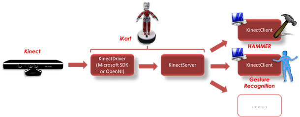

Kinect Wrapper
=============

A C++ [YARP](https://github.com/robotology/yarp) library that wraps around Kinect SDK or OpenNI device drivers. The code contained here derives from the code developed in the [EFAA](http://efaa.upf.edu/) EU project.

## Installation

##### Dependencies
- [YARP](https://github.com/robotology/yarp)
- [icub-contrib-common](https://github.com/robotology/icub-contrib-common)
- [Kinect SDK](https://www.microsoft.com/en-us/download/details.aspx?id=36996) and/or [OpenNI 1.X](https://github.com/OpenNI/OpenNI) (tested with v1.5.2.23 unstable or v1.5.4.0-7 from Ubuntu 14.04 repositories)
- [OpenCV](http://opencv.org/downloads.html)
- [NITE 1.X](http://www.mira-project.org/downloads/3rdparty/) (tested with v1.5.2.21)
- [SensorKinect](https://github.com/avin2/SensorKinect/releases) (tested with v0.92-5.1.2.1)

##### Cmaking the project
At cmake time, user can select which library to use by means of `USE_KinectSDK`, which can be `ON` (_Kinect SDK_) or `OFF` (_OpenNI_).

If you intend to rely on `Kinect SDK`, then it is required to setup the environment variable `KINECTSDK_DIR` pointing to the installed SDK, e.g. "C:\Program Files\Microsoft SDKs\Kinect\vx.y" (don't forget the double quotes).

To any rate, user can choose to build the client part only via `BUILD_CLIENT_ONLY` cmake variable (`FALSE` by default).

The project is composed of a library that the user can link against to get access to the client side of the kinectWrapper and a binary implementing the server side. For further details refer to the architecture hereinafter.

## Architecture

The main purpose of this YARP wrapper is to abstract from the hardware and provide data neatly and effectively over the network. The resulting gains are threefold: (1) the benefit in controlling the bandwidth while preventing data duplication; (2) the significant facilitation from user standpoint of writing code by means of proxy access to the hardware, with resort to a standard set of YARP API in place of direct calls to a custom set of Kinect API; (3) the possibility to easily scale up with the addition of new modules accessing the device.

The _Kinect Wrapper_ has been designed and implemented adhering to the client-server paradigm, where the server (i.e. `KinectServer`) takes care of streaming out all the information over YARP ports and the clients (i.e. `KinectClient`) are light YARP front-end instantiated within the user code that read Kinect data from the network and provide them in a convenient format.
To further separate the driver interfacing the Kinect device from the part of the sever dealing with YARP communication, a third abstraction layer has been considered, namely the `KinectDriver`, and located at lowest level in the wrapper hierarchy with the requirement of providing the `KinectServer` with the Kinect raw data to be marshaled and sent over the network. The `KinectDriver` is thus specialized in two implementations: the `KinectDriverSDK` and the `KinectDriverOpenNI`, respectively.

The hierarchical structure of the wrapper can be seen in the following diagram:

In particular, the `KinectServer` is realized as a periodic thread that initially opens the Kinect device using either the `KinectDriverSDK` or the `KinectDriverOpenNI` components; then, at each run, the server reads the information as configured by the user from the driver (depth data only, user skeleton only, RGB images only or combination of them) and sends them over YARP ports. On the client side, the user relies on a set of simple function calls to retrieve such information.

## Documentation

Online documentation is available here: [http://robotology.github.com/kinect-wrapper](http://robotology.github.com/kinect-wrapper).

## License

Material included here is Copyright of _Istituto Italiano di Tecnologia_ and _EFAA Consortium_. kinectWrapper is released under the terms of the GPL v2.0 or later. See the file LICENSE for details.
